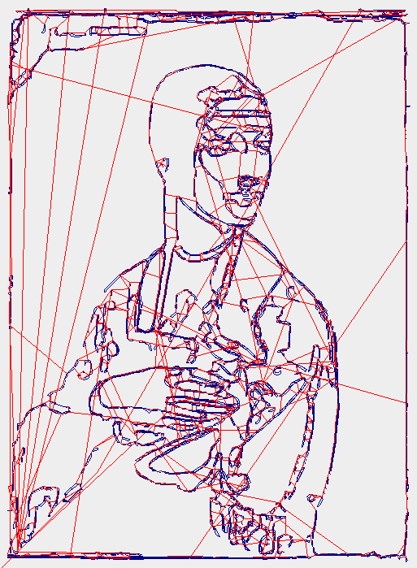
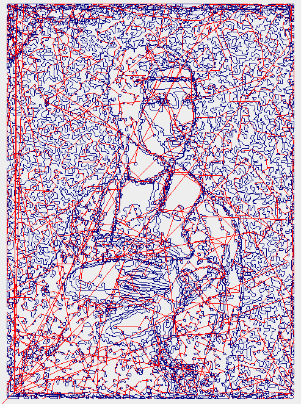
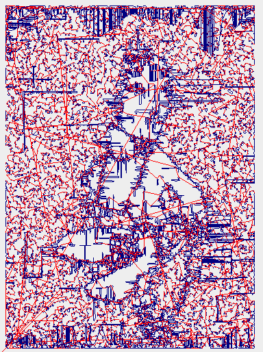
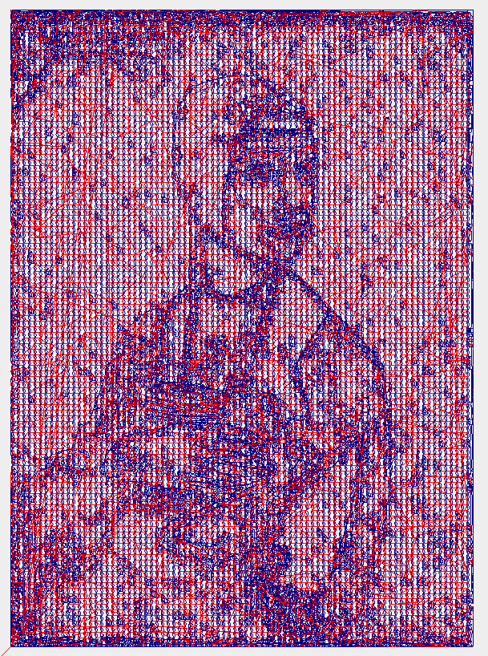

# Multicolor 3D Printer to 2D Plotter

Python pipeline converting raster images into multicolor plotter G-code for FDM 3D printers.

# Versions:
- plotter_universal_ver.py - all in one version, image as input -> G_code ready to be uploaded to your printer on the output
- external_gcode_ver.py - if you're using an external tool (ex. Inkscape), you can still upload your G_code to be filtered (add start and end sequence)
- image_processor.py - if you only want to add an effect to your image this is the version for you, no G_code generating

## Note

This is a university project. The pen change sequence assumes a camera trap mounted inside the printer chamber — when the printhead arrives at the designated position, it triggers a servo mechanism on the printhead to automatically swap the pen.

## Requirements

```bash
pip install Pillow scikit-learn numpy vtracer vpype vpype-gcode scipy opencv-python-headless
```

## Usage

```bash
python plotter_universal_ver.py  [options]
```

## Options

| Option | Default | Description |
|--------|---------|-------------|
| `-n` | `4` | Number of colors |
| `--printer` | `marlin` | `marlin` or `bambu` |
| `--paper` | `a4` | `a4`, `a5` or `a3` |
| `--z-up` | `5.0` | Pen lift height (mm) |
| `--margin` | `5.0` | Paper margin (mm) |
| `--photo-x` | `10.0` | Pen change position X (mm) |
| `--photo-y` | `10.0` | Pen change position Y (mm) |
| `--photo-wait` | `5000` | Wait time for servo (ms) |
| `--mode` | `default` | Image processing mode (see below) |
| `--mode_size` | `8` | Cell size (ASCII) / point count (voronoi, stippling) |
| `--stippling_radius` | `2` | Dot radius for stippling (px) |
| `--sketch_blur` | `21` | Gaussian blur for sketch mode |
| `--sketch_t1` | `30` | Canny lower threshold |
| `--sketch_t2` | `100` | Canny upper threshold |

## Image Modes

| Mode | Description |
|------|-------------|
| `default` | Binary mask, no processing |
| `ascii` | ASCII art representation |
| `voronoi` | Voronoi diagram from mask points |
| `stippling` | Weighted dot distribution by brightness |
| `sketch` | Pencil sketch via Canny edge detection |
| `ascii_color` | ASCII art representation in color - only in image_processor version |
| `voronoi_color` | Voronoi diagram from mask points in color - only in image_processor version  |
| `stippling_color` | Weighted dot distribution by brightness in color - only in image_processor version |
| `sketch_color` | Pencil sketch via Canny edge detection in color - only in image_processor version |

## Examples
More examples can be found in the Images project folder

| Mode | Result |
|------|--------|
| sketch |  |
| stippling |  |
| voronoi |  |
| ascii |  |


## Example usage

```bash
python plotter_universal_ver.py image.webp --printer bambu -n 4 --photo-x 200 --photo-y 10 --photo-wait 5000
python plotter_universal_ver.py image.webp --printer bambu -n 4 --mode stippling --mode_size 2000
python plotter_universal_ver.py image.webp --printer bambu -n 2 --mode sketch
```

## How it works

1. Splits image into N color layers using K-means clustering
2. Applies optional image processing mode to each layer
3. Vectorizes each layer (PNG → SVG) via vtracer
4. Converts to G-code via vpype
5. Scales all layers identically to fit the paper
6. Merges into one G-code file with automatic pen change sequences
